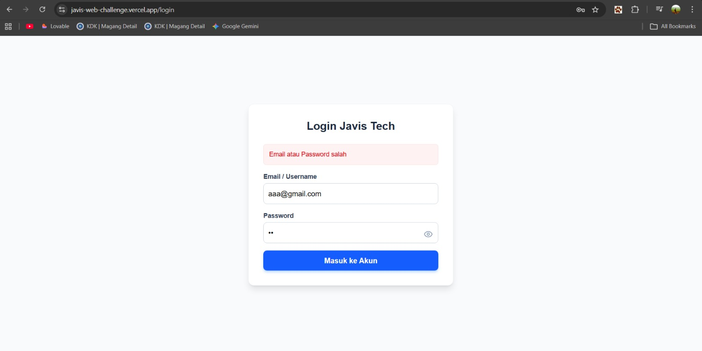

# Web Programmer Challenge - PT. Javis Teknologi Albarokah
Proyek ini adalah aplikasi web sederhana dengan fitur autentikasi login menggunakan Next.js.

## 🚀 Tech Stack
- [cite_start]**Frontend & Backend**: Next.js 15 (App Router) [cite: 18, 19]
- [cite_start]**Styling**: Tailwind CSS (Responsif & Clean UI) [cite: 16]
- [cite_start]**Authentication**: JSON Web Token (JWT) & HttpOnly Cookie [cite: 22]
- [cite_start]**Security**: Password Hashing menggunakan Bcrypt [cite: 21]
- **Icons**: Lucide React

## 🛠️ Fitur
- [cite_start]Form Login dengan validasi email [cite: 10, 11]
- [cite_start]Show/Hide Password [cite: 14]
- [cite_start]Protected Route (Halaman /dashboard tidak bisa diakses tanpa login) [cite: 23]
- [cite_start]Fitur Logout untuk menghapus sesi [cite: 24]
- [cite_start]Animasi loading saat proses login [cite: 28]

## 📋 Cara Menjalankan Project
1. Clone repository ini.
2. Jalankan perintah `npm install` untuk menginstall dependencies.
3. Jalankan perintah `npm run dev` untuk memulai server lokal.
4. Buka `http://localhost:3000` di browser Anda.

## 📸 Preview UI

**Akun Demo:**
- **Email:** admin@javis.com
- **Password:** password123

