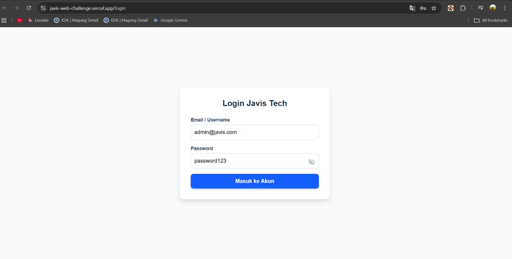
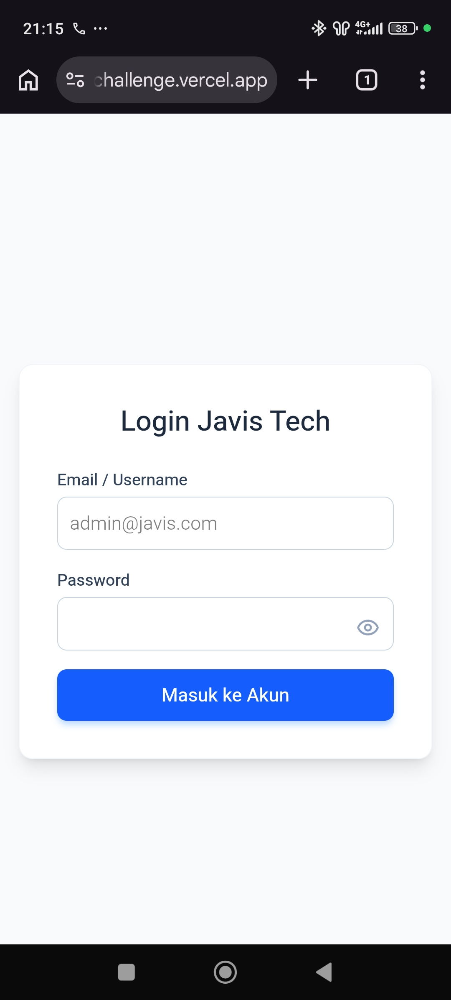
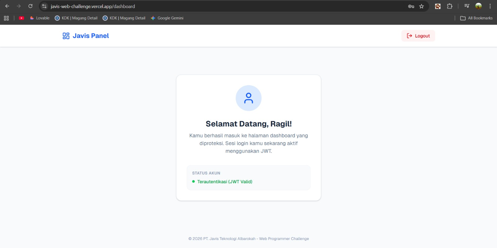
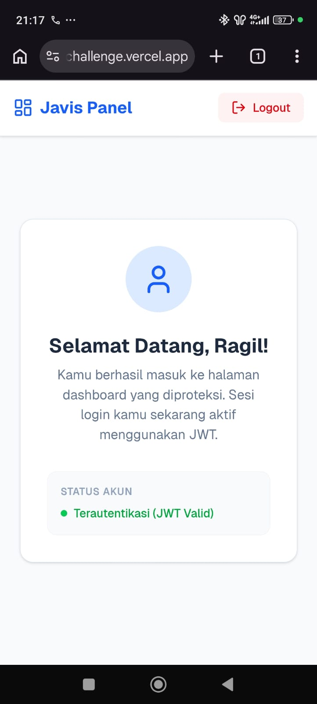

# Web Programmer Challenge - PT. Javis Teknologi Albarokah

Proyek ini adalah aplikasi web sederhana dengan fitur autentikasi login yang aman, dikembangkan sebagai bagian dari Web Programmer Challenge.

## 🚀 Tech Stack
- **Frontend & Backend**: Next.js 15 (App Router) - Fullstack Integration
- **Styling**: Tailwind CSS (Fully Responsive & Clean UI)
- **Authentication**: JSON Web Token (JWT) & HttpOnly Cookie
- **Security**: Password Hashing menggunakan Bcrypt & Rate Limiting (LRU Cache)
- **Icons**: Lucide React

## 🛠️ Fitur & Kriteria Tugas
- **Form Login**: Input Email/Username dan Password dengan validasi format.
- **Security**: Password disimpan menggunakan enkripsi Bcrypt dan sesi dikelola via HttpOnly Cookie (Aman dari XSS).
- **Show/Hide Password**: Fitur UI untuk kenyamanan user saat memasukkan kredensial.
- **Protected Route**: Halaman `/dashboard` diproteksi menggunakan Middleware (tidak bisa diakses tanpa login).
- **Rate Limiting (Bonus)**: Membatasi maksimal 5 percobaan login per menit untuk mencegah Brute Force.
- **Animasi Loading (Bonus)**: UX yang halus dengan spinner saat proses autentikasi berlangsung.
- **Fitur Logout**: Menghapus sesi secara aman dan mengarahkan kembali ke halaman login.

## 📋 Cara Menjalankan Project
1. Clone repository ini.
2. Jalankan perintah `npm install` untuk menginstall dependencies.
3. Jalankan perintah `npm run dev` untuk memulai server lokal.
4. Buka `http://localhost:3000` di browser Anda.

## 📸 Preview UI
| Desktop Login | Mobile Login |
|---|---|
|  |  |

| Desktop Dashboard | Mobile Dashboard |
|---|---|
|  |  |

## 🔑 Akun Demo
- **Email:** admin@javis.com
- **Password:** password123

**Link Live Demo (Vercel):** [https://javis-web-challenge.vercel.app/login]